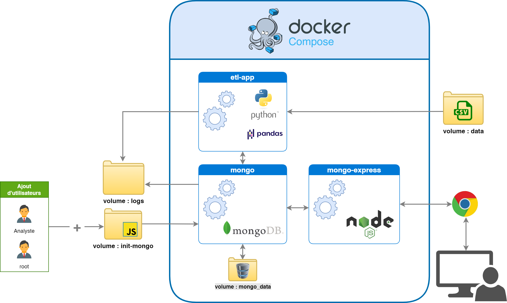
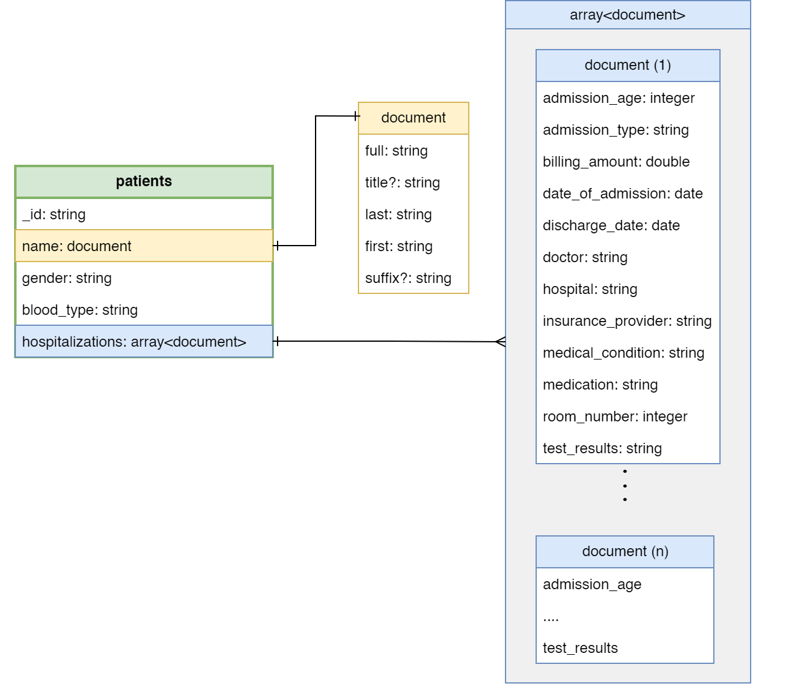
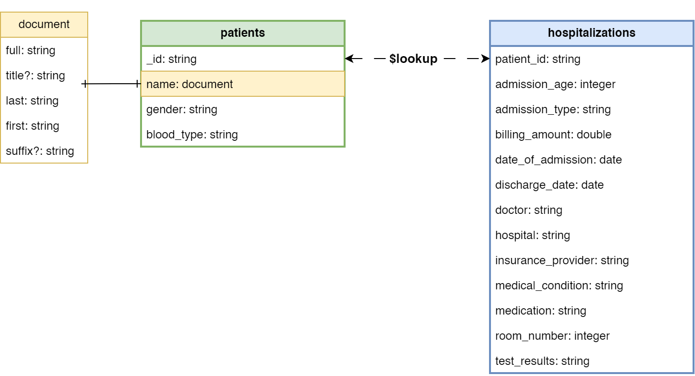

# Pipeline ETL pour Données Médicales vers MongoDB

[](https://www.python.org/)
[](https://www.mongodb.com/)
[](https://www.docker.com/)
[](https://github.com/mongo-express/mongo-express)
[](https://pandas.pydata.org/)
[](https://python-poetry.org/)
[](./docs/etl_medical_pipeline_presentation.pdf)

Ce projet met en place un pipeline ETL (Extract, Transform, Load) complet et de calibre professionnel pour migrer un jeu de données de patients depuis un fichier CSV vers une base de données NoSQL MongoDB. La solution est entièrement conteneurisée avec Docker, configurable, et conçue pour être robuste et maintenable.

Ce document sert de guide complet pour comprendre l'architecture, le fonctionnement, et les décisions de conception du projet.

## 🎯 Contexte et Objectifs

La mission initiale était de migrer un dataset de données médicales pour un client de DataSoluTech, afin de lui fournir une solution de stockage plus moderne, performante et scalable. Au-delà de la simple migration, les objectifs suivants ont été atteints :

-   **Fiabilité des Données :** Assurer la propreté, la déduplication et la structuration logique des données.
-   **Reproductibilité :** Créer un environnement 100% reproductible grâce à Docker.
-   **Flexibilité :** Permettre le choix entre deux stratégies de modélisation NoSQL (`embedding` vs `reference`).
-   **Sécurité :** Mettre en place un système d'authentification avec des rôles utilisateurs distincts.
-   **Maintenabilité :** Produire un code propre, orienté objet, et configurable via des variables d'environnement.

## 🏗️ Architecture de la Solution

La solution est orchestrée par `docker-compose.yml` et s'articule autour de trois services principaux communiquant via un réseau privé `etl-network`.



-   **`etl-app`**: Le cœur du pipeline. Un conteneur Python qui exécute le script `etl.py`. Il dépend du service `mongo` pour s'assurer que la base de données est prête avant de démarrer.
-   **`mongo`**: Le service de base de données MongoDB. Il est configuré pour persister les données via un volume nommé (`mongo_data`) et pour centraliser ses logs. Au premier démarrage, il exécute un script d'initialisation pour créer les utilisateurs.
- **`mongo-express`**: Une interface web d'administration pour visualiser et interroger facilement la base de données. Par défaut, elle est configurée pour se connecter avec l'utilisateur **administrateur** afin de faciliter le développement et le debug. Il est cependant possible de la reconfigurer pour utiliser le compte **analyste** en lecture seule (voir la section *Utilisation Avancée*).

## 🔐 Sécurité et Authentification

Le pipeline met en place un système d'authentification robuste pour la base de données, conformément aux meilleures pratiques. La configuration est gérée par le script `mongo-init/init-mongo.js`, qui s'exécute au premier démarrage du service MongoDB.

### Rôles Utilisateurs
Deux utilisateurs distincts sont créés automatiquement, chacun avec des permissions spécifiques pour garantir le principe du moindre privilège :
-   **Un utilisateur ETL (défini par les variables `MONGO_ROOT_*` dans `.env`)** : Cet utilisateur possède les droits de lecture et d'écriture (`readWrite`) sur la base `medical_db`. Son rôle est exclusivement de permettre au pipeline ETL de nettoyer et de charger les données.
-   **Un utilisateur Analyste (défini par les variables `MONGO_ANALYST_*` dans `.env`)** : Cet utilisateur possède uniquement les droits de lecture (`read`). Il est destiné aux applications de reporting ou aux analystes qui doivent consulter les données sans jamais pouvoir les modifier.

### Hachage des Mots de Passe
La sécurité des mots de passe est entièrement déléguée à MongoDB. Notre script fournit les mots de passe lors de la création des utilisateurs, et MongoDB se charge automatiquement de :
1.  **Hacher** le mot de passe en utilisant un algorithme sécurisé (SCRAM-SHA-256).
2.  **Saler** le hash pour le rendre unique et résistant aux attaques par tables arc-en-ciel.
3.  Stocker **uniquement l'empreinte sécurisée**, jamais le mot de passe en clair.

Nous n'implémentons pas le hachage nous-mêmes, mais nous utilisons la fonctionnalité de sécurité native et éprouvée de MongoDB pour garantir la protection des identifiants.

## 💾 Modélisation des Données

L'analyse initiale a révélé que le dataset source représentait des **hospitalisations** et non des patients uniques. Pour répondre à cette réalité, le pipeline a été conçu pour supporter deux stratégies de modélisation NoSQL, sélectionnables via la variable `DATA_MODELLING_MODE` dans le fichier `config/config.py`.

### 1. Modèle `embedding` (par défaut)

Ce modèle est optimisé pour les cas d'usage où les lectures sont fréquentes (ex: afficher l'historique complet d'un patient). Chaque document de la collection `patients` représente un patient unique et contient un tableau imbriqué de toutes ses hospitalisations. Cette approche permet de récupérer toutes les informations d'un patient en une seule opération de lecture.



### 2. Modèle `reference`

Ce modèle normalise les données dans deux collections distinctes, ce qui est idéal pour les environnements avec de nombreuses mises à jour ou si les listes d'hospitalisations deviennent très grandes. La relation entre les deux collections est établie via un champ `patient_id` et peut être résolue à la lecture grâce à l'opération `$lookup`.



## 🚀 Installation et Lancement

Suivez ces étapes pour lancer le projet complet.

### 1. Prérequis
- [Docker](https://www.docker.com/products/docker-desktop/) et Docker Compose installés.
- [Git](https://git-scm.com/downloads) installé.

### 2. Cloner le Dépôt
```bash
git clone https://github.com/abguven/P5-medical-data-etl-pipeline.git
cd P5-medical-data-etl-pipeline
```

### 3. Configurer les Variables d'Environnement
Le projet utilise des variables d'environnement pour gérer les secrets et la configuration.

Copiez le fichier d'exemple et personnalisez-le si nécessaire (notamment les mots de passe).
```bash
cp .env.example .env
```
Ouvrez le fichier `.env` et modifiez les valeurs `MONGO_PASSWORD` et `WEB_PASSWORD`. Vous pouvez aussi changer le `DATA_MODELLING_MODE` pour tester les deux stratégies.

### 4. Lancer le Pipeline Complet
Cette commande va construire l'image Python, démarrer la base de données, exécuter le script ETL, puis lancer l'interface web.

🏷️ Vous avez deux options pour lancer les services :

```bash
# Option 1: Lancer tous les services en arrière-plan (detached mode)
docker compose up -d --build

# Option 2: Lancer tous les services au premier plan (les logs s'affichent directement dans la console)
docker compose up --build
```
Le pipeline s'exécute automatiquement au démarrage. La première exécution peut prendre un peu de temps pour télécharger les images et installer les dépendances.
### 🐧 Note Spécifique pour les Utilisateurs Linux

Docker sous Linux gère les permissions des volumes de manière stricte. Si vous rencontrez une erreur de permission au démarrage du service `mongo` (liée à l'impossibilité d'écrire dans les fichiers de log), cela signifie que le conteneur n'a pas les droits d'écriture sur le dossier `logs/` de votre machine.

Pour résoudre ce problème, assurez-vous que ce dossier appartient à l'utilisateur `mongodb` (UID `999`) qui est utilisé à l'intérieur du conteneur.

Exécutez la commande suivante à la racine de votre projet **avant** de lancer `docker compose up` :

```bash
# Crée le dossier s'il n'existe pas
mkdir -p logs

# Donne la possession du dossier à l'UID approprié
sudo chown -R 999:999 logs/
```

## 🛠️ Utilisation et Monitoring

### Accéder aux Données
- **Mongo Express (Interface Web)**: Ouvrez votre navigateur et allez sur [http://localhost:8081](http://localhost:8081).
  - Utilisez les identifiants `WEB_USERNAME` et `WEB_PASSWORD` définis dans votre fichier `.env` pour vous connecter.

### Monitoring et Debug
```bash
# Voir les logs en temps réel (-f) de tous les services
docker compose logs -f

# Voir les logs en temps réel (-f) d'un service spécifique (ex: mongo-express)
docker compose logs -f mongo-express

# Voir les logs spécifiques du script ETL
docker compose logs etl-app

# Entrer dans le conteneur ETL pour un debug avancé
docker compose exec etl-app bash
```

### Arrêter les Services
Pour arrêter tous les conteneurs :
```bash
docker compose down
```
Pour un nettoyage complet (incluant la suppression du volume de données MongoDB) :
```bash
docker compose down -v
```

### ⚙️ Utilisation Avancée : Tester la Connexion Analyste

Par défaut, `mongo-express` se connecte avec les droits d'administrateur pour faciliter le développement. Pour tester la vue d'un utilisateur en lecture seule, vous pouvez modifier le fichier `docker-compose.yml` :

1.  Ouvrez le fichier `docker-compose.yml`.
2.  Naviguez jusqu'à la section `environment` du service `mongo-express`.
3.  **Commentez** les lignes de la `CONNEXION ADMIN`.
4.  **Décommentez** les lignes de la `CONNEXION ANALYSTE`.
5.  Relancez les services pour appliquer les changements :
    ```bash
    docker compose up -d --build
    ```
L'interface web n'aura maintenant que des droits de lecture sur la base `medical_db`.

---